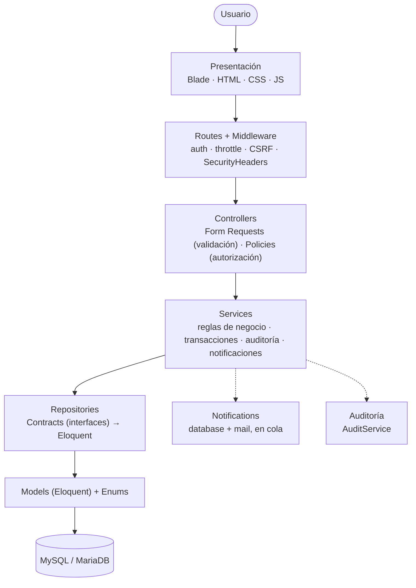

# Sistema web para la gestión y seguimiento de proyectos académicos

Proyecto de la asignatura **Arquitectura de Software**. Aplicación web que centraliza la gestión de
proyectos académicos universitarios: integrantes, tareas, avances, comentarios, notificaciones, auditoría
y seguimiento docente.

| | |
|---|---|
| **Arquitectura** | Monolito modular · Arquitectura en capas · MVC · Service Layer · Repository Pattern |
| **Stack** | PHP 8.5 · Laravel 13 · Blade/HTML/CSS/JS · MySQL 8 (compatible con MariaDB) · Eloquent |
| **Calidad** | 215 pruebas automatizadas (unitarias, funcionales y de arquitectura) · OWASP Top 10 revisado |

---

## Contenido
1. [Descripción y objetivo](#1-descripción-y-objetivo)
2. [Tecnologías](#2-tecnologías)
3. [Requisitos](#3-requisitos)
4. [Instalación](#4-instalación)
5. [Configuración y variables de entorno](#5-configuración-y-variables-de-entorno)
6. [Migraciones y seeders](#6-migraciones-y-seeders)
7. [Ejecución](#7-ejecución)
8. [Usuarios de prueba](#8-usuarios-de-prueba)
9. [Arquitectura](#9-arquitectura)
10. [Roles y permisos](#10-roles-y-permisos)
11. [Módulos y funcionalidades](#11-módulos-y-funcionalidades)
12. [Pruebas](#12-pruebas)
13. [Documentación](#13-documentación)
14. [Alcance del MVP](#14-alcance-del-mvp)

---

## 1. Descripción y objetivo

**Problema:** la información de los proyectos académicos suele estar dispersa en chats, correos y hojas de
cálculo, y el docente tiene dificultades para conocer el avance real de cada equipo.

**Objetivo:** centralizar la información de los proyectos y facilitar su gestión y seguimiento, con cuatro
roles:

- **Estudiante:** participa en proyectos, actualiza el avance de sus tareas y comenta.
- **Líder de proyecto:** estudiante que además gestiona el proyecto, sus integrantes y sus tareas.
- **Docente:** supervisa proyectos, registra observaciones, cierra proyectos revisados y consulta la auditoría.
- **Administrador:** acceso global a todos los proyectos, auditoría completa y gestión de roles de usuario.

## 2. Tecnologías

| Capa | Tecnología | Uso |
|---|---|---|
| Backend | PHP 8.3+ · **Laravel 13** | Framework MVC, contenedor de dependencias, colas, Scheduler |
| Autenticación | **Laravel Fortify** | Registro, login, logout y recuperación de contraseña (backend oficial, sin frontend) |
| Frontend | **Blade** · HTML5 · CSS3 · JavaScript *vanilla* | Vistas del servidor; CSS y JS estáticos en `public/` (sin Node ni Vite) |
| Base de datos | **MySQL 8** / MariaDB 10.6+ | Persistencia relacional (migraciones portables) |
| ORM | **Eloquent** | Modelos y relaciones, solo dentro de los repositorios |
| Pruebas | PHPUnit · SQLite en memoria | Suites Unit, Feature y Architecture |
| Modelado | draw.io | `docs/diagramas/*.drawio` |
| Versionado | Git · GitHub | Un commit por fase de desarrollo |

## 3. Requisitos

- PHP **8.3 o superior** con las extensiones `pdo_mysql`, `mbstring`, `openssl`, `intl`, `bcmath`, `fileinfo`
  y `tokenizer`.
- **Composer 2.**
- **MySQL 8** o **MariaDB 10.6+**, con una base de datos y un usuario creados.
- (Opcional) Una cuenta SMTP (p. ej. Gmail con contraseña de aplicación) para enviar correos reales.

> No se necesita Node.js: el frontend no requiere compilación (ADR-010).

## 4. Instalación

```bash
# 1. Clonar e instalar dependencias
git clone <url-del-repositorio> gestion-proyectos-academicos
cd gestion-proyectos-academicos
composer install

# 2. Crear la base de datos (ejemplo MySQL)
mysql -u root -p -e "CREATE DATABASE gestion_proyectos CHARACTER SET utf8mb4 COLLATE utf8mb4_unicode_ci;
  CREATE USER 'gestion_user'@'localhost' IDENTIFIED BY 'una-contraseña-segura';
  GRANT ALL PRIVILEGES ON gestion_proyectos.* TO 'gestion_user'@'localhost';"

# 3. Configurar el entorno
cp .env.example .env          # completar DB_* (y MAIL_* si se enviarán correos)
php artisan key:generate

# 4. Crear las tablas y los datos de demostración
php artisan migrate --seed
```

## 5. Configuración y variables de entorno

Todas las credenciales van en `.env`, que **nunca** se versiona. `.env.example` está documentado sección
por sección.

| Variable | Descripción | Valor de ejemplo |
|---|---|---|
| `APP_ENV` / `APP_DEBUG` | Entorno y modo depuración | `local` / `true` (producción: `production` / `false`) |
| `APP_URL` | URL base; se usa en los enlaces de los correos | `http://localhost:8000` |
| `APP_LOCALE` | Idioma de la interfaz y los mensajes | `es` |
| `DB_CONNECTION` | Motor de base de datos | `mysql` (o `mariadb`) |
| `DB_HOST`, `DB_PORT`, `DB_DATABASE`, `DB_USERNAME`, `DB_PASSWORD` | Conexión | `127.0.0.1`, `3306`, `gestion_proyectos`, … |
| `SESSION_ENCRYPT` | Cifra el contenido de la sesión en BD | `true` |
| `SESSION_SECURE_COOKIE` | Cookie solo por HTTPS (producción) | `true` en producción |
| `QUEUE_CONNECTION` | Cola de notificaciones y correos | `database` |
| `MAIL_MAILER` | `log` (sin envío, escribe en el log) o `smtp` | `log` |
| `MAIL_HOST`, `MAIL_PORT`, `MAIL_SCHEME`, `MAIL_USERNAME`, `MAIL_PASSWORD` | Servidor SMTP | Gmail: `smtp.gmail.com`, `587`, `smtp` |
| `MAIL_FROM_ADDRESS` | Remitente de los correos | `no-reply@…` |
| `MAIL_TO_ADDRESS` | **Solo desarrollo:** redirige todos los correos a un buzón | tu correo (vacío en producción) |

La configuración de Gmail paso a paso está en [`docs/05-guia-de-pruebas.md`](docs/05-guia-de-pruebas.md) §1.3,
y la de producción en [`docs/07-seguridad.md`](docs/07-seguridad.md) §4.

## 6. Migraciones y seeders

```bash
php artisan migrate               # crea o actualiza las tablas
php artisan migrate --seed        # crea las tablas y carga el catálogo + datos demo
php artisan migrate:fresh --seed  # BORRA todo y vuelve a empezar (solo desarrollo)
```

| Seeder | Contenido | Entornos |
|---|---|---|
| `RolePermissionSeeder` | 4 roles y 22 permisos; el administrador recibe todos (idempotente) | Todos |
| `DemoUserSeeder` | 5 usuarios de prueba | `local`, `testing` |
| `DemoProjectSeeder` | Proyecto demo con líder, integrante y docente | `local`, `testing` |
| `DemoTaskSeeder` | 5 tareas que cubren todos los estados | `local`, `testing` |
| `DemoCommentSeeder` | Comentarios y una observación docente | `local`, `testing` |

Los datos demo se crean **mediante los Services**, así que respetan las mismas reglas de negocio que la
interfaz. Sembrar datos **nunca envía correos reales**.

## 7. Ejecución

Se necesitan **dos procesos**:

```bash
php artisan serve        # Terminal 1: aplicación en http://127.0.0.1:8000
php artisan queue:work   # Terminal 2: procesa notificaciones y envía correos
```

Proceso diario (tareas vencidas y recordatorios), ejecutable a mano:
```bash
php artisan tasks:check-deadlines
```
En producción se programa con el cron de Laravel:
`* * * * * cd /ruta/proyecto && php artisan schedule:run >> /dev/null 2>&1`.

**Primer administrador** en un entorno sin datos demo (p. ej. producción): el usuario se registra
normalmente y luego, en el servidor:
```bash
php artisan users:grant-admin correo@dominio.com
```

## 8. Usuarios de prueba

Credenciales ficticias; todos usan la contraseña **`password`**:

| Correo | Rol | Situación en el proyecto demo |
|---|---|---|
| `admin@demo.test` | Administrador | Acceso global; gestiona los roles en **Usuarios** |
| `lider@demo.test` | Estudiante + Líder | Líder del proyecto |
| `estudiante@demo.test` | Estudiante | Integrante con tareas asignadas |
| `estudiante2@demo.test` | Estudiante | No participa (sirve para probar accesos denegados) |
| `docente@demo.test` | Docente | Docente responsable |

> Estas contraseñas no cumplen la política de contraseñas (mínimo 8 caracteres con letras y números)
> porque se cargan directo en la base de datos. Solo existen en desarrollo.

## 9. Arquitectura

**Monolito modular** organizado en **capas** con dependencia estrictamente descendente:



| Capa | Responsabilidad | No hace |
|---|---|---|
| Blade | Mostrar datos ya preparados | Consultas ni reglas de negocio |
| Controllers | Autorizar, validar con Form Request y delegar en un Service | Lógica de negocio ni consultas |
| Services | Reglas de negocio, transacciones, auditoría y notificaciones | SQL/Eloquent, HTTP |
| Repositories | Consultas Eloquent detrás de interfaces | Reglas de negocio |
| Models | Relaciones, casts y consultas simples de pertenencia | Procesos de negocio |

Estas reglas **no dependen solo de la disciplina**: la suite `tests/Architecture` las verifica sobre el
código fuente.

**Flujo de una acción importante** (p. ej. el docente registra una observación):

```
autorizar (Policy) → validar (Form Request) → regla de negocio (Service)
   → persistir (Repository) + auditar   [misma transacción]
   → notificar (después del commit; correo en cola si el evento es crítico)
```

**Estructura del código:**

```
app/
├── Http/Controllers, Requests, Middleware   Presentación / entrada HTTP
├── Policies/                                Autorización por registro
├── Services/                                Casos de uso (reglas de negocio)
├── Repositories/Contracts, Eloquent         Acceso a datos
├── Models/ · Enums/                         Entidades y estados
├── Notifications/ · Listeners/              Notificaciones y auditoría de autenticación
└── Console/Commands/                        Proceso diario de fechas límite
```

Detalle completo en [`docs/01-arquitectura.md`](docs/01-arquitectura.md). Las 18 decisiones arquitectónicas
(ADR) y su justificación están en [`docs/04-decisiones-arquitectonicas.md`](docs/04-decisiones-arquitectonicas.md).

## 10. Roles y permisos

La autorización tiene **dos niveles**, siempre validados en el backend (ocultar un botón es solo una ayuda
visual):

1. **Permiso** (por rol, en BD): ¿este *tipo* de usuario puede hacer X? → `Gate::before` con permisos `modulo.accion`.
2. **Policy** (por registro): ¿puede hacerlo sobre *este* proyecto o tarea? → `app/Policies`.

| Permiso | Estudiante | Líder* | Docente | Administrador |
|---|:-:|:-:|:-:|:-:|
| `proyecto.ver` / `proyecto.crear` | ✔ / ✔ | ✔ / ✔ | ✔ / — | ✔ (todos) / —** |
| `proyecto.editar` · `proyecto.eliminar` · `proyecto.gestionar_integrantes` | | ✔ | | ✔ (todos) |
| `proyecto.cambiar_estado` | | ✔ | ✔ (finaliza o devuelve desde revisión) | ✔ (transiciones válidas) |
| `tarea.ver` | ✔ | ✔ | ✔ | ✔ |
| `tarea.crear` · `tarea.editar` · `tarea.asignar` · `tarea.eliminar` | | ✔ | | ✔ |
| `tarea.cambiar_estado` | ✔ (solo las suyas) | ✔ | | ✔ |
| `comentario.ver` · `crear` · `editar` · `eliminar` (propios) | ✔ | ✔ | ✔ (+ observaciones) | ✔ (+ eliminar ajenos: moderación) |
| `notificacion.ver` · `notificacion.marcar_leida` | ✔ | ✔ | ✔ | ✔ |
| `auditoria.ver` | | | ✔ (sus proyectos) | ✔ |
| `auditoria.ver_todo` · `rol.gestionar` · `sistema.administrar` | | | | ✔ |

\* El líder es un estudiante con el rol adicional `LIDER`, asignado automáticamente cuando lidera un
proyecto; los permisos de sus roles se suman. Tener el rol no da acceso a proyectos ajenos: la Policy exige
ser el líder de *ese* proyecto.

\*\* El **administrador** tiene todos los permisos y acceso global (`sistema.administrar`), pero **no omite
las reglas que valen para todos** (ADR-018):
- la auditoría no se modifica;
- nadie edita comentarios ajenos;
- las observaciones son del docente;
- quien crea un proyecto queda como su líder, y el líder es un estudiante;
- las reglas de negocio (transiciones válidas, no retirar al líder…) se aplican igual.

**Agregar un rol nuevo no requiere cambiar la estructura:** basta con insertar el rol y asociarle permisos.
El propio rol Administrador se incorporó así después del MVP (ADR-018).

Reglas completas: [`docs/03-reglas-de-negocio.md`](docs/03-reglas-de-negocio.md).

## 11. Módulos y funcionalidades

| Módulo | Funcionalidades principales |
|---|---|
| Autenticación | Registro (siempre como estudiante), login, logout, recuperación de contraseña, bloqueo tras 5 intentos |
| Usuarios y roles | Catálogo en BD, rol Líder automático, gestión de roles por el administrador con salvaguardas, matriz verificada por pruebas |
| Proyectos | CRUD, ciclo de estados (planeación → en progreso → en revisión → finalizado / cancelado), eliminación lógica |
| Integrantes | Agregar y retirar (sin duplicados), transferir liderazgo, el líder no puede retirarse |
| Tareas | CRUD, asignación, prioridad, fechas dentro del proyecto, coherencia estado/avance, papelera y restauración |
| Seguimiento | Avance calculado a partir de las tareas, conteo por estado, próximas fechas límite, dashboard por rol |
| Comentarios | En proyectos y tareas, observaciones formales del docente, edición y eliminación por el autor |
| Notificaciones | Internas + correo para eventos críticos, en cola, recordatorios de fechas límite |
| Auditoría | Registro inmutable de acciones (con IP y valores anteriores/nuevos), consulta con filtros; el administrador ve toda la auditoría |

## 12. Pruebas

```bash
php artisan test                        # 215 pruebas
php artisan test --testsuite=Architecture
```

| Suite | Pruebas | Qué verifica |
|---|---:|---|
| Unit | 32 | Reglas de los Services con repositorios simulados |
| Feature | 171 | Flujos HTTP completos, autorización, administración, seguridad, notificaciones, auditoría |
| Architecture | 12 | Reglas de capas sobre el código fuente |

- Estrategia y trazabilidad requisito → prueba: [`docs/06-estrategia-de-pruebas.md`](docs/06-estrategia-de-pruebas.md).
- Pruebas manuales paso a paso: [`docs/05-guia-de-pruebas.md`](docs/05-guia-de-pruebas.md).

## 13. Documentación

| Documento | Contenido |
|---|---|
| [`01-arquitectura.md`](docs/01-arquitectura.md) | Trazabilidad problema → tecnologías, atributos de calidad, capas, módulos, estructura |
| [`02-modelo-de-datos.md`](docs/02-modelo-de-datos.md) | Diagrama ER, diccionario de datos, relaciones, integridad y normalización |
| [`03-reglas-de-negocio.md`](docs/03-reglas-de-negocio.md) | Permisos, estados, reglas por módulo, catálogos de notificaciones y auditoría, rutas |
| [`04-decisiones-arquitectonicas.md`](docs/04-decisiones-arquitectonicas.md) | 18 ADR: contexto, decisión, justificación y consecuencias |
| [`05-guia-de-pruebas.md`](docs/05-guia-de-pruebas.md) | Instalación, ejecución y escenarios de prueba manual por módulo |
| [`06-estrategia-de-pruebas.md`](docs/06-estrategia-de-pruebas.md) | Pirámide de pruebas, trazabilidad, arquitectura, N+1, mutaciones |
| [`07-seguridad.md`](docs/07-seguridad.md) | Revisión OWASP Top 10, configuración de producción, riesgos aceptados |
| [`diagramas/`](docs/diagramas) | Diagramas editables en draw.io: capas y modelo entidad-relación |

### Trazabilidad arquitectónica (resumen)

| Problema | Requerimientos | Atributos de calidad | Decisiones | Componentes |
|---|---|---|---|---|
| Información dispersa y seguimiento difícil | Proyectos, integrantes, tareas, seguimiento, comentarios, notificaciones, auditoría, permisos | Seguridad · Mantenibilidad · Escalabilidad · Usabilidad · Rendimiento · Trazabilidad | Laravel · MVC · Capas · Service Layer · Repository · Policies/Gates · Notificaciones · Auditoría · MySQL/MariaDB | Blade · Controllers · Services · Repositories · Models · Policies · Notifications · Jobs · BD |

## 14. Alcance del MVP

**Incluido:** autenticación, roles, permisos, usuarios, proyectos, integrantes, tareas, seguimiento,
comentarios, notificaciones internas, recordatorios, correos para eventos importantes y auditoría.

**Fuera del alcance:** aplicación móvil, chat en tiempo real, videollamadas, WhatsApp/SMS, inteligencia
artificial, Google Calendar, integración con sistemas institucionales, microservicios, pagos y gestión de
notas académicas.
