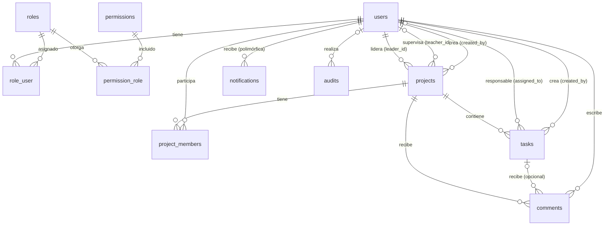

# 02 · Modelo de datos

Motor: **MySQL 8** (InnoDB, `utf8mb4`). El esquema usa solo tipos y restricciones estándar, por lo que es
compatible con **MariaDB** sin cambios (ver ADR-001).

## 1. Diagrama entidad-relación

## 2. Diccionario de datos

Convenciones: PK `id` BIGINT UNSIGNED autoincremental; `timestamps` = `created_at`, `updated_at`.
Los estados y prioridades se guardan como `VARCHAR` y se validan con Enums de PHP (ADR-004).

### users *(Laravel, ampliada)*
| Columna | Tipo | Restricciones |
|---|---|---|
| id | BIGINT UNSIGNED | PK |
| name | VARCHAR(255) | NOT NULL |
| email | VARCHAR(255) | NOT NULL, **UNIQUE** |
| email_verified_at | TIMESTAMP | NULL |
| password | VARCHAR(255) | NOT NULL (hash bcrypt) |
| remember_token | VARCHAR(100) | NULL |
| timestamps | | |

### roles
| Columna | Tipo | Restricciones |
|---|---|---|
| id | BIGINT UNSIGNED | PK |
| name | VARCHAR(50) | NOT NULL, **UNIQUE** (`ESTUDIANTE`, `LIDER`, `DOCENTE`) |
| display_name | VARCHAR(100) | NOT NULL |
| description | VARCHAR(255) | NULL |
| timestamps | | |

### permissions
| Columna | Tipo | Restricciones |
|---|---|---|
| id | BIGINT UNSIGNED | PK |
| name | VARCHAR(100) | NOT NULL, **UNIQUE** (`proyecto.crear`, …) |
| module | VARCHAR(50) | NOT NULL, INDEX (`proyecto`, `tarea`, …) para agrupar en pantalla |
| description | VARCHAR(255) | NULL |
| timestamps | | |

### role_user *(pivote N:M)*
| Columna | Tipo | Restricciones |
|---|---|---|
| role_id | BIGINT UNSIGNED | FK → roles.id ON DELETE CASCADE |
| user_id | BIGINT UNSIGNED | FK → users.id ON DELETE CASCADE |
| created_at | TIMESTAMP | fecha de asignación |
| | | **PK (user_id, role_id)** |

### permission_role *(pivote N:M)*
| Columna | Tipo | Restricciones |
|---|---|---|
| permission_id | BIGINT UNSIGNED | FK → permissions.id ON DELETE CASCADE |
| role_id | BIGINT UNSIGNED | FK → roles.id ON DELETE CASCADE |
| | | **PK (role_id, permission_id)** |

### projects
| Columna | Tipo | Restricciones |
|---|---|---|
| id | BIGINT UNSIGNED | PK |
| title | VARCHAR(150) | NOT NULL |
| description | TEXT | NOT NULL |
| objectives | TEXT | NULL |
| status | VARCHAR(20) | NOT NULL, default `planeacion`, INDEX |
| start_date | DATE | NOT NULL |
| end_date | DATE | NULL, validado ≥ start_date |
| leader_id | BIGINT UNSIGNED | FK → users.id **ON DELETE RESTRICT**, INDEX |
| teacher_id | BIGINT UNSIGNED | FK → users.id ON DELETE SET NULL, NULL, INDEX |
| created_by | BIGINT UNSIGNED | FK → users.id ON DELETE RESTRICT |
| timestamps | | |
| deleted_at | TIMESTAMP | NULL, **soft delete** |

> **No existe columna `progress`.** El avance del proyecto se calcula a partir de sus tareas (ADR-005).

### project_members
| Columna | Tipo | Restricciones |
|---|---|---|
| id | BIGINT UNSIGNED | PK |
| project_id | BIGINT UNSIGNED | FK → projects.id ON DELETE CASCADE |
| user_id | BIGINT UNSIGNED | FK → users.id ON DELETE CASCADE, INDEX |
| timestamps | | `created_at` = fecha de ingreso |
| | | **UNIQUE (project_id, user_id)**: impide integrantes duplicados |

El líder **también** es una fila de `project_members`. `projects.leader_id` indica cuál de los integrantes
es el líder (ADR-006).

### tasks
| Columna | Tipo | Restricciones |
|---|---|---|
| id | BIGINT UNSIGNED | PK |
| project_id | BIGINT UNSIGNED | FK → projects.id ON DELETE CASCADE |
| assigned_to | BIGINT UNSIGNED | FK → users.id ON DELETE SET NULL, NULL |
| created_by | BIGINT UNSIGNED | FK → users.id ON DELETE RESTRICT |
| title | VARCHAR(150) | NOT NULL |
| description | TEXT | NULL |
| status | VARCHAR(20) | NOT NULL, default `pendiente` |
| priority | VARCHAR(10) | NOT NULL, default `media` |
| progress | TINYINT UNSIGNED | NOT NULL, default 0, rango 0–100 |
| start_date | DATE | NULL |
| due_date | DATE | NOT NULL, INDEX |
| completed_at | TIMESTAMP | NULL |
| due_reminder_sent_at | TIMESTAMP | NULL, evita recordatorios duplicados |
| timestamps | | |
| deleted_at | TIMESTAMP | NULL, **soft delete** (ADR-013) |
| | | INDEX (project_id, status), INDEX (assigned_to, status) |

Las tareas se eliminan de forma lógica (permiso `tarea.eliminar`, solo el líder) y pueden restaurarse desde
la papelera del proyecto. Una tarea eliminada no cuenta en el seguimiento.

### comments
| Columna | Tipo | Restricciones |
|---|---|---|
| id | BIGINT UNSIGNED | PK |
| project_id | BIGINT UNSIGNED | FK → projects.id ON DELETE CASCADE |
| task_id | BIGINT UNSIGNED | FK → tasks.id ON DELETE CASCADE, **NULL** (NULL = comentario del proyecto) |
| user_id | BIGINT UNSIGNED | FK → users.id ON DELETE RESTRICT (autor) |
| body | TEXT | NOT NULL |
| is_observation | BOOLEAN | default false (observación formal del docente) |
| timestamps | | `created_at` = fecha; `updated_at` evidencia una edición |
| | | INDEX (project_id, created_at), INDEX (task_id) |

### notifications *(tabla nativa de Laravel)*
| Columna | Tipo | Restricciones |
|---|---|---|
| id | CHAR(36) UUID | PK |
| type | VARCHAR(255) | clase de la notificación |
| notifiable_type / notifiable_id | | morph → users |
| data | TEXT (JSON) | mensaje, URL, ids relacionados |
| read_at | TIMESTAMP | NULL = no leída |
| timestamps | | |

### audits
| Columna | Tipo | Restricciones |
|---|---|---|
| id | BIGINT UNSIGNED | PK |
| user_id | BIGINT UNSIGNED | FK → users.id ON DELETE SET NULL, NULL (NULL = acción del sistema, p. ej. el Scheduler) |
| action | VARCHAR(60) | NOT NULL (`project.created`, `task.status_changed`, `auth.login`, …) |
| module | VARCHAR(30) | NOT NULL (`proyectos`, `tareas`, …) |
| auditable_type | VARCHAR(255) | NULL, clase de la entidad afectada |
| auditable_id | BIGINT UNSIGNED | NULL, id del registro afectado |
| project_id | BIGINT UNSIGNED | NULL, **contexto**: proyecto al que pertenece la entidad (sin FK). Lo completa `AuditService` |
| old_values | JSON | NULL, solo los campos que cambiaron |
| new_values | JSON | NULL |
| ip_address | VARCHAR(45) | NULL (IPv4/IPv6) |
| user_agent | VARCHAR(255) | NULL |
| created_at | TIMESTAMP | NOT NULL, INDEX, **sin `updated_at`: registro inmutable** |
| | | INDEX (auditable_type, auditable_id), INDEX (module, action), INDEX (user_id), INDEX (project_id, created_at) |

### Tablas de infraestructura de Laravel
`password_reset_tokens`, `sessions`, `cache`, `cache_locks`, `jobs`, `job_batches`, `failed_jobs`.
Son necesarias para recuperar contraseña, las sesiones y las colas de correos. No pertenecen al dominio.

## 3. Relaciones Eloquent

| Modelo | Relación | Tipo |
|---|---|---|
| User | roles | belongsToMany(Role) |
| User | memberships / projects | hasMany(ProjectMember) / belongsToMany(Project, project_members) |
| User | ledProjects | hasMany(Project, leader_id) |
| User | supervisedProjects | hasMany(Project, teacher_id) |
| User | assignedTasks | hasMany(Task, assigned_to) |
| User | audits | hasMany(Audit) |
| User | notifications | trait `Notifiable` |
| Role | permissions / users | belongsToMany |
| Project | leader, teacher, creator | belongsTo(User) |
| Project | members | belongsToMany(User, project_members)->withTimestamps() |
| Project | tasks, comments | hasMany |
| Task | project | belongsTo(Project) |
| Task | assignee, creator | belongsTo(User) |
| Task | comments | hasMany(Comment) |
| Comment | project, task, author | belongsTo |
| Audit | user | belongsTo(User) |
| Audit | auditable | morphTo |

## 4. Reglas de integridad

**Garantizadas por la base de datos**
- Integrante único por proyecto: `UNIQUE (project_id, user_id)`.
- Email único; nombres únicos de rol y de permiso.
- No se puede borrar físicamente un usuario que lidera o creó proyectos: `RESTRICT`.

**Garantizadas por la capa de Services**
- `leader_id` siempre corresponde a un integrante del proyecto.
- `teacher_id` corresponde a un usuario con rol `DOCENTE`.
- `assigned_to` corresponde a un integrante del proyecto.
- `comments.task_id`, cuando existe, pertenece al mismo `project_id`.
- Coherencia entre estado y avance de las tareas (ver `03-reglas-de-negocio.md`).

## 5. Decisiones de normalización

- **Comentarios con `project_id` + `task_id` opcional**, en lugar de una relación polimórfica.
  - Ventaja: claves foráneas reales y consultas o autorización directas por proyecto.
  - Costo: existe una dependencia controlada (`task_id → project_id`), que valida el `CommentService` (ADR-007).
- **Auditoría polimórfica** (`auditable_type/id` sin FK), a propósito: el registro debe sobrevivir aunque la
  entidad auditada se elimine.
- **`audits.project_id` es un dato de contexto desnormalizado a propósito.** Se deriva de la entidad (tarea →
  su proyecto), pero guardarlo evita joins polimórficos para consultar "todo lo ocurrido en un proyecto" y para
  limitar al docente a sus proyectos. Como la auditoría es inmutable, este dato no puede desincronizarse.
- **Soft delete en `projects`, `tasks` y `comments`** (ADR-013). Así se conserva el historial y la
  trazabilidad. No se aplica a `project_members` (rompería el UNIQUE al reincorporar a alguien; el historial
  queda en auditoría), a `audits` (inmutable) ni a `users` o `notifications` (el MVP no los elimina).
